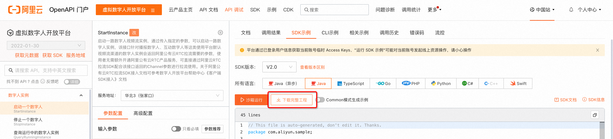
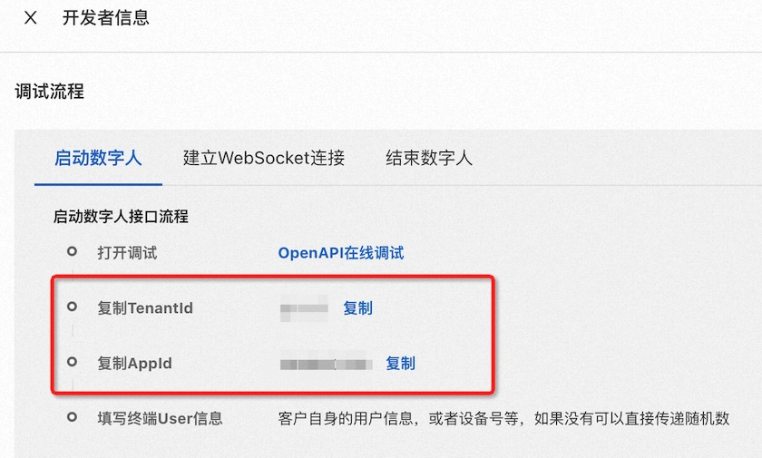

# 简介

本 repo 提供了使用AliyunAvatarSDK的样例程序，有助于在Android端快速上手和体验[阿里云虚拟数字人](https://www.aliyun.com/product/ai/avatar)产品。

# 快速开始

## 前置条件

已开通[阿里云虚拟数字人](https://www.aliyun.com/product/ai/avatar)产品

## 鉴权

> 阿里云账号AccessKey拥有所有API的访问权限，建议您使用RAM用户进行API访问或日常运维。
> 强烈建议不要把AccessKey ID和AccessKey Secret保存到工程代码里，否则可能导致AccessKey泄露，威胁您账号下所有资源的安全。
> 因此，本示例中不包含直接在Android端调用OpenAPI的代码示例。
> 在实际应用中，如确需由Android侧发起OpenAPI请求，建议您可以使用STS Token来实现API访问的身份验证。具体配置操作，请参见 [使用STS Token调用API](https://help.aliyun.com/document_detail/606934.html)。

### StartInstanceResponseData

虚拟数字人开放平台[StartInstance]()接口的返回数据，可以通过[OpenAPI门户](https://next.api.aliyun.com/product/avatar)打开StartInstance接口的调试页面，点击SDK示例，下载完整工程并运行，获取到接口返回。

数据格式如下所示：

```json
{
  "channel": {
    "appId": "",
    "channelId": "",
    "expiredTime": "",
    "gslb": [
      ""
    ],
    "nonce": "",
    "token": "",
    "type": "",
    "userId": ""
  },
  "requestId": "",
  "sessionId": "",
  "token": ""
}
```

### TenantId及 AppId

打开[虚拟数字人开放平台控制台](https://avatar.console.aliyun.com/#/developer-center/project-manager)，点击指定项目上的**开发者信息**获取。


## 互动数字人

### 绿幕抠图

绿幕抠图功能需要Android端与后端同步配置。在调用StartInstance接口时，若入参的AlphaSwitch字段为true，则需要将本Demo中的绿幕抠图开关打开，否则需要关闭。若前后端的配置不同步，则可能会出现显示异常。

### 其他配置

均可参考SDK文档中的说明

## 播报数字人

### 绿幕抠图

绿幕抠图功能需要Android端与后端同步配置。在调用StartInstance接口时，若入参的AlphaSwitch字段为true，则需要将本Demo中的绿幕抠图开关打开，否则需要关闭。若前后端的配置不同步，则可能会出现显示异常。

### 播报文本

需要使用后端应用调用[SendMessage](https://help.aliyun.com/document_detail/412624.html)接口来体验此功能。
